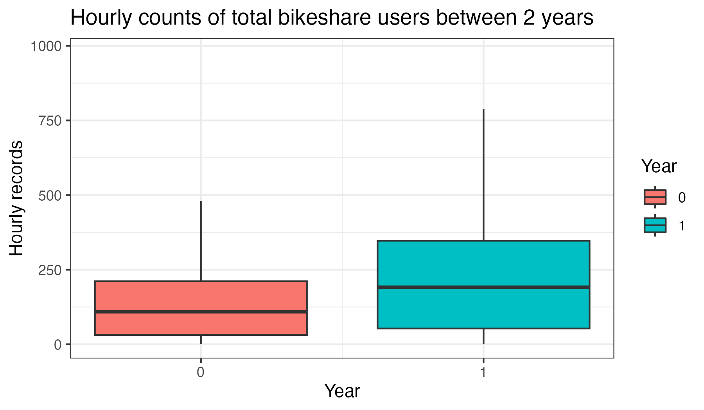

```{r setup, include=FALSE}
knitr::opts_chunk$set(echo = TRUE)
set.seed(1) # seed for any random generation
```

This term project paper is saved on GitHub repository for better
co-working. [Here](https://github.com/ht6631/STA545_Final_Project) is the link.

# 1. Abstract

# 2. Introduction

## a. Data description

### Read data and simple processing.

```{r}
suppressPackageStartupMessages(library(tidyverse)) # just in case
library(ISLR2)
library(tidyverse)
library(dplyr)
library(naniar)
suppressPackageStartupMessages(library(lubridate))
suppressPackageStartupMessages(library(glmnet)) # penalized linear models
suppressPackageStartupMessages(library(glmnetUtils))  # for quality of life functions over glmnet
suppressPackageStartupMessages(library(corrplot)) # correlation plots
suppressPackageStartupMessages(library(pls)) # for pcr
#call data
origin_data=read_csv('Bike-Sharing-Dataset/hour.csv',show_col_types = FALSE)
#Check how many predictors have NAs
origin_data%>%miss_var_summary()%>%filter(n_miss!=0)%>%nrow()%>%print()
#Avoid changing original data
bs_hour=origin_data%>%mutate(dteday=as.Date(dteday))%>%dplyr::select(-instant)
#Add one hourly identifiable column to identify every row 
bs_hour=bs_hour%>%mutate(hourly_id=paste(as.character(dteday),as.character(hr)))%>%mutate(hourly_id=ymd_h(hourly_id))
bs_hour=bs_hour[,c(1:15,17,16)]
bs_hour$windspeed=as.numeric(bs_hour$windspeed)
```

### Scatter plots and box plots.

```{r,out.width='50%'}
col_vec_scatter=colnames(bs_hour)[10:15]
col_vec_box=colnames(bs_hour)[2:9]
for (value in col_vec_scatter) {
    print(ggplot(bs_hour)+geom_point(aes_string(value,'cnt'))+theme_bw()+
            theme(axis.title.y=element_text(size=16),
        axis.title.x=element_text(size=16)))
}
for (value in col_vec_box) {
    print(ggplot(bs_hour)+geom_boxplot(aes_string(value,'cnt',group=value))+theme_bw())+
            theme(axis.title.y=element_text(size=16),
        axis.title.x=element_text(size=16))
}
cor(bs_hour[, -c(1,16)]) %>% 
  corrplot::corrplot()
```

From these plots, it seems counts of total bikeshare users have slight
positive correlation with time information like "hr" (hour), similar
situations are seen for feeling temperature and temperature. While for
"hum" which is humidity, there is a negative correlation.

## b. Materials and methods.

First, our group discovered this data set for some useful information.

### Material question 1. Would the hourly distributions of bikeshare users on working days / non-working days different, and what about casual / registered users?

#### Total bikeshare users
```{r,echo=FALSE,out.width='70%',fig.align='center'}
ggplot(bs_hour)+
  geom_boxplot(aes(hr,cnt,group=interaction(workingday,hr),fill=factor(workingday)),outlier.shape = NA)+
  theme_bw()+
  xlab('Hour')+ylab('Hourly records')+
  labs(fill='Workingday',title='Hourly distribution of total bikeshare users')+
  scale_x_continuous(breaks=seq(0,24,2))
```

**The answer is Yes.** \newline \*\*Before 6am,\*\* there are a few bike
share users for both working-day types while more people on non-working
days tend to use bike share from 0am to 2am. \newline \*\*From 6am to
11pm,\*\* Two peaks of users are shown around 8am and 5pm on working
days, which may reflect commuting during the rush hours. While on
non-working days, we saw a smooth increasing then decreasing trend on
bike share users.\newline

#### Registered bikeshare users
```{r,echo=FALSE,out.width='70%',fig.align='center'}
ggplot(bs_hour)+
  geom_boxplot(aes(hr,registered,group=interaction(workingday,hr),fill=factor(workingday)),outlier.shape = NA)+
  theme_bw()+
  xlab('Hour')+ylab('Hourly records')+
  labs(fill='Workingday',title='Hourly distribution of registered bikeshare users')+
  scale_x_continuous(breaks=seq(0,24,2))
```

**The hourly distribution of registered users are quite like that of the
total users.**

#### Casual bikeshare users
```{r,echo=FALSE,out.width='70%',fig.align='center'}
ggplot(bs_hour)+
  geom_boxplot(aes(hr,casual,group=interaction(workingday,hr),fill=factor(workingday)),outlier.shape = NA)+
  theme_bw()+
  xlab('Hour')+ylab('Hourly records')+
  labs(fill='Workingday',title='Hourly distribution of casual bikeshare users')+
  scale_x_continuous(breaks=seq(0,24,2))
```

**Casual users tend to use bikeshare more often on non-workding days
while there is no strong evidence they would use bikeshare for commuting
on rush hours.**

### Material question 2. Would bikeshare users counts on different weather be different, and what about casual / registered users?

#### Total bikeshare users
```{r,echo=FALSE,out.width='80%',fig.align='center'}
ggplot(bs_hour)+
  geom_boxplot(aes(weathersit,cnt,group=factor(weathersit),fill=factor(weathersit)),outlier.shape = NA)+
  theme_bw()+
  xlab('Weathersit')+ylab('Hourly records')+
  labs(fill='Weathersit',title='Total bikeshare users on different weather')
```

**Here's the description for weather type 1 - 4:** \newline weathersit :
\newline - 1: Clear, Few clouds, Partly cloudy, Partly cloudy \newline -
2: Mist + Cloudy, Mist + Broken clouds, Mist + Few clouds, Mist
\newline - 3: Light Snow, Light Rain + Thunderstorm + Scattered clouds,
Light Rain + Scattered clouds \newline - 4: Heavy Rain + Ice Pallets +
Thunderstorm + Mist, Snow + Fogv \newline \newline From these boxplots,
it's obvious that from weather type 1 - 4, people are becoming more
unwillingly to use bike share. This makes sense because commonly
speaking, ordinary people would see weather type from 1 - 4 as weather
getting worse. And for type 4, it's definitely bad weather.\newline
\newline Box plots for registered and casual users show just the same
trend.

### Material question 3. Influence of weathertype on likely commuters during rush hours

First let's find out likely commuters (registered users during rush
hours on workding days)
```{r}
bs_rush=bs_hour%>%filter(hr %in% c(7,8,9,16,17,18,19))%>%filter(workingday==1)
bs_rush$hr=as.factor(bs_rush$hr)
```

#### Hourly grouped weather influence
```{r,echo=FALSE,out.width='80%',fig.align='center'}
ggplot(bs_rush)+
  geom_boxplot(aes(hr,registered,group=interaction(weathersit,hr),fill=factor(weathersit)),outlier.shape = NA)+
  theme_bw()+
  xlab('Hour')+ylab('Hourly records')+
  labs(fill='Weathersit',title='Hourly counts of likely commuters under different weather')
```

**During the rush hours in the morning**, weather type 1 and 2 seems
have similar pattern, a little cloudy weather won't affect people's
choice in the morning. Only when weather getting worse to type 3 or 4,
people would not willing to ride a bike. \newline \newline \*\*However
during the afternoon rush hours\*\*, things are different. As the
weather getting worse, even a little cloudy would make people not
willing to ride a bike.

## c. Regression question

After discovering this dataset, our group agreed to study the pattern of
"likely commuters" which are registered users during rush hours on
working days. \newline \newline We will include related variables to
predict the counts of likely commuters. There are multiple regression
methods we used, including PCR, ridge and lasso regression to identify
which predictors contribute more, meanwhile, linear regression, decision
tree, and random forest are also included for a general modeling.

### Methods group 1: linear regression, decision tree, and random forest

```{r}
library(leaps)
library(glmnet)
library(glmnetUtils)
library(MASS)
library(ISLR2)
library(tidyverse)

library(rpart)
library(rpart.plot)
library(randomForest) 
library(gbm)

# This investigation only concerns the rush hours (7AM,8AM,9AM,4PM,5PM,6PM,7PM)

hour_orig <- read_csv('Bike-Sharing-Dataset/hour.csv',show_col_types = FALSE);

# filtering out irrelevant data
hour.filtered <- subset(hour_orig, workingday >.5)
hour.filtered <- subset(hour.filtered, hr %in% c(7,8,9,16,17,18,19))

hour <- hour.filtered[,c("mnth","hr","atemp","weathersit","hum","windspeed","registered")]
```

#### Performing a linear regression, and getting the R\^2 value.

```{r}
hour.lm <- lm(registered ~ ., data = hour)
hour.lm.r2 <- summary(hour.lm)$r.squared
hour.lm.r2
```

The r-squared value for linear regression is 0.245, meaning 24.5% of the
error is explained by the model.

#### Performing a decision tree analysis and getting the R\^2 value.

```{r}
set.seed(1)
train.hour <- sample(1:nrow(hour), nrow(hour) / 2)
tree.hour <- rpart(registered ~ ., data = hour, subset = train.hour)
rpart.plot(tree.hour)
summary(tree.hour)
best_cp <- tree.hour$cptable %>% 
  as_tibble() %>% 
  filter(xerror == min(xerror)) %>% 
  head(1) %>% 
  pull(CP) # note the best CP is 0.01, which corresponds with the most (11) splits
prune.hour <- prune(tree.hour, cp = best_cp)
rpart.plot(prune.hour)

yhat <- predict(tree.hour, newdata = hour[-train.hour, ])
test.hour <- hour[-train.hour, "registered"]
test.hour <- as.integer(unlist(test.hour))
plot(yhat, test.hour)
abline(0, 1)
mean((yhat - test.hour)^2) 
tmp <- printcp(tree.hour)
tree.hour.r2.table <- 1-tmp[,c(3,4)]
tree.hour.r2 <- tree.hour.r2.table[11,1]
tree.hour.r2
```

The R\^2 value is 0.540, meaning 54.0% of the error is explained by the
model.

#### Performing a random forest and getting the R\^2 value.

```{r}
set.seed(2)

rf.hour <- randomForest(
  registered ~ .,
  data = hour,
  subset = train.hour,
  # mtry = 5, 
  importance = TRUE,
  ntree = 5000
  
)

# predict.rf.hour <- predict(rf.hour, test_data, type = "class")
###
importance(rf.hour)
###
varImpPlot(rf.hour)
rf.hour.rsq.list  <- rf.hour$rsq
rf.hour.rsq <- rf.hour.rsq.list[5000]
rf.hour.rsq
```

The R\^2 value is 0.658, meaning 65.8% of the error is explained by the
model.

### Methods group 2: PCR, ridge and lasso regression.

#### data processing

```{r}
set.seed(1)

regression_model=bs_hour%>%filter(hr %in% c(7,8,9,16,17,18,19))%>%filter(workingday==1)
regression_model=regression_model[,-which(names(regression_model) == "dteday")]
regression_model=regression_model[,-which(names(regression_model) == "season")]
regression_model=regression_model[,-which(names(regression_model) == "yr")]
regression_model=regression_model[,-which(names(regression_model) == "holiday")]
regression_model=regression_model[,-which(names(regression_model) == "workingday")]
regression_model=regression_model[,-which(names(regression_model) == "temp")]
regression_model=regression_model[,-which(names(regression_model) == "casual")]
regression_model=regression_model[,-which(names(regression_model) == "hourly_id")]
regression_model=regression_model[,-which(names(regression_model) == "cnt")]

indice_train = sample(seq_len(nrow(regression_model)),size = 0.2*nrow(regression_model))
indice_test =  seq_len(nrow(regression_model)) %>%
setdiff(indice_train)
```

#### pcr

```{r}
# fit pcr on training set
pcr = pcr(registered ~ ., data = regression_model,subset = indice_train)
y_prediction_pcr = predict(pcr, regression_model[indice_test, ])

## residual sum of squares
validationplot(pcr, val.type = "R2")
```

If we use the 7 variables, we obtain r2 =0,25

```{r}

pred_error_all = sapply(
  1:6,
  function(i) mean((y_prediction_pcr[, , i] - regression_model[indice_test ,]$registered)^2))
# find which M minimizes prediction error
pcr$coefficients[, , which.min(pred_error_all)]
```

#### ridge

```{r}
# cross validation based tuning of lambda
#cv glmnet implement already 10 cross validation
ridge = cv.glmnet(   
registered ~ .,
data = regression_model,
alpha = 0
)
# ridge with optimal lambda
ridgefit = glmnet(
registered ~ .,
data = regression_model,
alpha = 0,
lambda = ridge$lambda.1se # optimal lambda
)

y_pred_ridge = predict(ridgefit, newdata = regression_model)

sst = sum((regression_model$registered - mean(regression_model$registered))^2)
sse =sum((y_pred_ridge - regression_model$registered)^2)

r2 = 1 - (sse/sst)
r2
```

```{r}
coef(ridgefit)
```

#### lasso

```{r}
# cross validation based tuning of lambda
lasso=  cv.glmnet(
registered ~ .,
data = regression_model,
alpha = 1
)
# lasso with optimal lambda
lassofit = glmnet(
registered ~ .,
data = regression_model,
alpha = 1,
lambda = lasso$lambda.1se # optimal lambda
)
# predict on test set
pred_lasso = predict(lassofit, newdata = regression_model)


sst = sum((regression_model$registered - mean(regression_model$registered))^2)
sse =sum((pred_lasso - regression_model$registered)^2)

r2 = 1 - (sse/sst)
r2
```

```{r}
coef(lassofit)
```

# 4. Conclusion

## a. Which predictor affects dependent variable more?

Though it's shown to have little influence on the count of registered
users in linear regression, Ridge, PCR and Lasso, "hr" which is the hour
predictor actually explains much of the variation of dependent variable
under a non-linear method like tree-based regression and random forest.
Using "hr" as an factor to fit multiple parallel linear regression model
with different intercept would be a solution for a better fit. \newline
\newline Not surprisingly, the feeling temperature does contribute a lot
on likely commuters' choice, which is seen by all the linear models and
tree-based methods. And followed are predictors like humidity, month and
weather type. Wind speed shows little influence on dependent variable
estimation in random forest modeling while it's been excluded in Lasso
with "weekday"\newline \newline

## b. Explanation to low variation explained.

In the regression part, our group used 7 predictors for a general model
to explain which predictor affects the number of likely commuters,
excluding time information like "yr" (year) and redundant information
like temperature (because we included feeling temperature). However, an
increasing of total bikeshare users could be seen from the first year to
the second, as shown in next boxplots.

```{r, echo=FALSE}

```

Thus, combined with the fact that relations between independent and
dependent variables are quite non-linear, it's understandable that our
regression modeling not performing well.

# 5. Author contributions

## Hang:

Project report: structure building; data description, plots part;
\newline Github repository creating;
